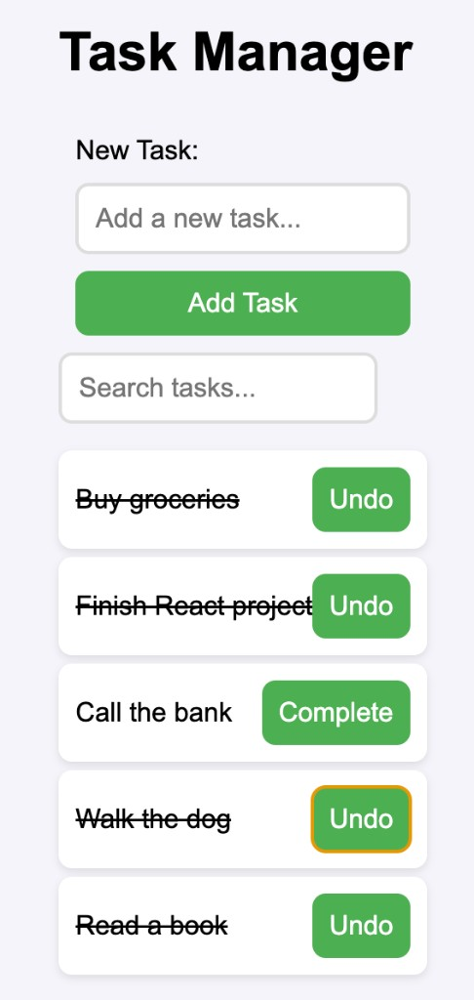

# Task Manager

A beginner-friendly React app for adding, completing, and searching tasks. Tasks are stored with json-server so the list survives a refresh.



## Features

- **Add tasks** from a labeled form. `useId` gives the input a unique id so the label stays connected for accessibility.
- **Mark tasks complete or undo** with a button. `useContext` shares the task list and `toggleComplete` so any component can update the same data.
- **Search as you type**. `useRef` is attached to the search input; `TaskList` filters the shared task list by that query.
- **Persistent data**. New tasks are `POST`ed and completed flags are `PATCH`ed to `db.json` through json-server on port 6001.

## Built With

- [React 19](https://react.dev/) (`useContext`, `useId`, `useRef`)
- [Vite](https://vite.dev/)
- [json-server](https://github.com/typicode/json-server)
- [Vitest](https://vitest.dev/) and [Testing Library](https://testing-library.com/)

## Getting Started

### Prerequisites

- Node.js (LTS recommended)
- npm

### Install

```sh
npm install
```

### Run the backend

json-server reads and writes `db.json`:

```sh
npm run server
```

The API is at `http://localhost:6001/tasks`.

### Run the frontend

In a second terminal:

```sh
npm run dev
```

Open the URL Vite prints (usually `http://localhost:5173`).

### Run tests

```sh
npm run test
```

## How the pieces fit together

| Piece | Role |
| --- | --- |
| `TaskProvider` (`src/context/TaskContext.jsx`) | Holds `tasks`, loads them on mount, exposes `addTask` and `toggleComplete` |
| `App` | Layout: heading, form, and search |
| `TaskForm` | Controlled input with `useId`; submits via `addTask` |
| `SearchBar` | Search input with `useRef`; passes `query` to the list |
| `TaskList` | Reads tasks from context, filters by `query`, toggles complete on click |

`main.jsx` wraps the app in `TaskProvider` so every child can use `TaskContext`.

## Project Status

The app loads tasks from context, submits new tasks, marks them complete, and filters the list from the search input. The included test suite should pass.

## License

This project is a class lab and is not published under a separate license.
